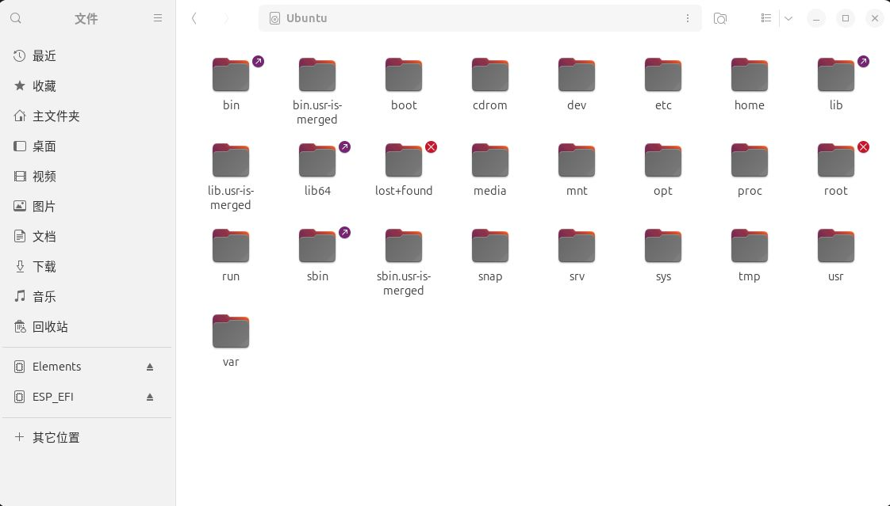

### Docker Hub下载

```bash
# 从Docker Hub下载
docker pull lmsysorg/sglang:latest
```

### 运行镜像

```bash
docker run lmsysorg/sglang:latest
```

### 启动docker服务

```bash
# 启动服务
sudo systemctl start docker

# 设置开机自启
sudo systemctl enable docker
```

### 检查是否安装

```bash
# 检查是否安装
docker --version
```

### 检查服务状态

```bash
# 检查服务状态
sudo systemctl status docker

# 重启Docker
sudo systemctl restart docker
```

```bash
● docker.service - Docker Application Container Engine
   Loaded: loaded (/lib/systemd/system/docker.service; enabled; vendor preset: enabled)
   Active: active (running) since ...
```

这样的输出，说明正在运行

### 查看Docker系统状态

```bash
# 查看Docker磁盘使用情况
docker system df

# 输出示例：
# TYPE            TOTAL     ACTIVE    SIZE      RECLAIMABLE
# Images          1         0         2.3GB     2.3GB (100%)
# Containers      0         0         0B        0B
# Local Volumes   0         0         0B        0B
# Build Cache     0         0         0B        0B
```

### 查看所有已下载的镜像

```bash
# 查看所有已下载的镜像
docker images
```

### 使用docker启动sglang服务

```bash
docker run \                             # 基础命令：运行容器
    --gpus all \                         # 参数1：使用所有GPU
    --shm-size 32g \                     # 参数2：共享内存大小
    -p 30000:30000 \                     # 参数3：端口映射
    -v ~/.cache/huggingface:/root/.cache/huggingface \  # 参数4：数据卷挂载
#    -v ~/jiewc/model-download \  # 本地模型目录  \
    --env "HF_TOKEN=hf_xxx" \          # 参数5：环境变量
    --ipc=host \                         # 参数6：IPC设置
    lmsysorg/sglang:latest \             # 参数7：镜像名称
    python3 -m sglang.launch_server \    # 参数8：启动命令
    --model-path deepseek-ai/DeepSeek-R1-Distill-Qwen-1.5B \  # 参数9：模型路径
    --gpu-memory-utilization 0.85 \
    --max-model-len 1024 \
    --host 0.0.0.0 \                     # 参数10：监听地址
    --port 30000                         # 参数11：服务端口
```

```bash
docker run \
    --gpus all \
    --shm-size 32g \
    -p 30000:30000 \
    -v ~/.cache/huggingface:/root/.cache/huggingface \
    --env "HF_TOKEN=hf_xxx" \
    --ipc=host \
    lmsysorg/sglang:latest \
    python3 -m sglang.launch_server \
    --model-path deepseek-ai/DeepSeek-R1-Distill-Qwen-1.5B \
    --gpu-memory-utilization 0.85 \
    --max-model-len 1024 \
    --host 0.0.0.0 \
    --port 30000 
```

### 配置nvidia的gpu

```
sudo nvidia-ctk runtime configure --runtime=docker
└──┬─── └──┬─── └──────┬─────────   └──┬───
   │       │           │               └── 要配置的运行时：docker
   │       │           └── 子命令：配置（configure）
   │       └── 工具：NVIDIA容器工具包命令行工具
   └── 权限：需要管理员权限
```

### 容器启动

```bash
docker run -it --rm\
    --gpus all \
    --shm-size 32g \
    -p 30000:30000 \
    -v ~/.cache/huggingface:/root/.cache/huggingface \
    --env "HF_TOKEN=hf_xxx" \
    --ipc=host \
    lmsysorg/sglang:latest
```

- -it参数：就像你租了个房子，**搬进去住**，可以在里面做饭、看电视、睡觉，房子会一直保留，直到你主动**退租**（输入`exit`）
- --rm参数： "退租时自动打扫"。正常退租：房子空了，但还在那里（浪费空间）。加 `--rm`：退租时**自动拆掉房子**，不占地方。

### 重新打开没用 `--rm`的容器

```bash
# 第一次启动（没用 --rm）
docker run -it --name my-sglang 镜像名 /bin/bash
# 在容器里做了一些工作...
exit
```

```bash
# 查看已停止的容器
docker ps -a

# 重新启动
docker start -ai my-sglang
# -a: 附加到终端
# -i: 交互式
```

### 查看正在运行的容器

```bash
# 最简单的查看方法
docker ps
# 查看所有容器（包括已停止的）
docker ps -a
```

### 进入已经启动的容器

```bash
# 进入正在运行的容器
docker exec -it <容器名或容器ID> /bin/bash

# 示例
docker exec -it deepseek /bin/bash
docker exec -it deepseek /bin/sh
docker exec -it deepseek bash
```

### docker容器自动生成的名字

当你**不指定容器名**时，Docker 会自动生成一个 **"形容词_名人姓氏"** 的组合，🤔作为默认名字：

```bash
# 格式：形容词_科学家姓氏
gifted_lovelace
# gifted = 有天赋的
# lovelace = 阿达·洛芙莱斯（第一位程序员）
```

其他例子：

```bash
# 你可能见过的名字：
admiring_bohr        # 崇拜的玻尔
angry_goldberg       # 生气的戈德堡
blissful_mcclintock  # 幸福的麦克林托克
clever_turing        # 聪明的图灵
```

### 为什么在图片中看不到 sgl-workspace



```bash
root@db640c6290fa:/# ls
bin                dev   lib                media                     opt   run                 sgl-workspace  tmp
bin.usr-is-merged  etc   lib64              mnt                       proc  sbin                srv            usr
boot               home  lib.usr-is-merged  NGC-DL-CONTAINER-LICENSE  root  sbin.usr-is-merged  sys            var
```

图片显示的是 **Ubuntu 宿主机的根目录** (`/`)，包含：

- `/bin`, `/boot`, `/dev`, `/etc`, `/home`, `/lib`, `/usr`, `/var`等

**但是**，`sgl-workspace`目录存在于 **Docker 容器内部**，不在宿主机上。

也就是说一个是容器内的`/`目录，一个是宿主机的`/`目录

创建容器时的挂载，也是指这两个不同的“机器”的目录中某个文件夹的挂载

**容器启动后无法直接添加新的挂载卷！**

### 容器内～指的是/root/文件夹

```bash
root@db640c6290fa:/# cd ~
root@db640c6290fa:~# ls
root@db640c6290fa:~# cd ..
root@db640c6290fa:/# cd root
root@db640c6290fa:~# cd ..
```

### 删除容器

```bash
docker stop 容器名  # 优雅停止
docker rm 容器名    # 删除
```

```bash
# 删除所有已停止的容器
docker container prune

# 强制删除所有容器（包括运行中的）
docker container prune -f
```

### 停止容器

```bash
docker stop 容器名  # 优雅停止
```

