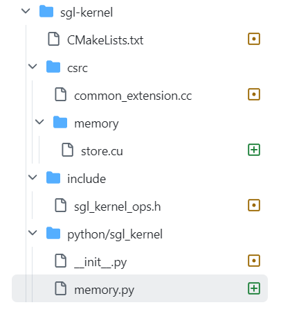
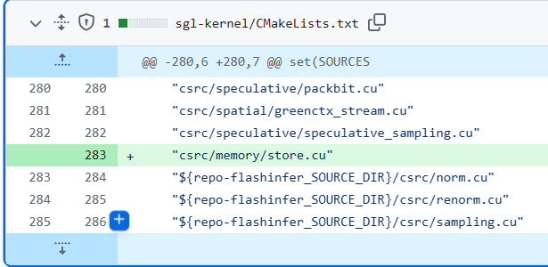
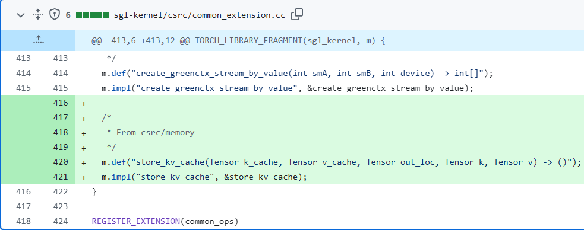
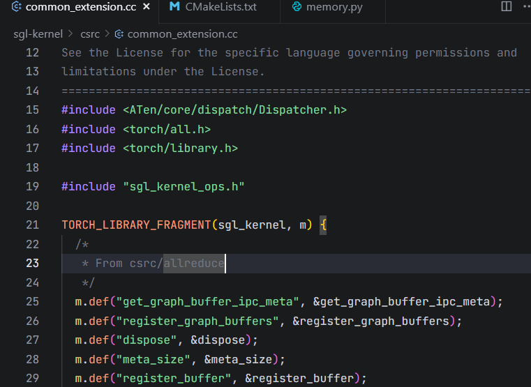
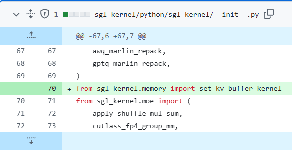

## sgl_kernel算子增加流程



### CMakeLists



CMakeLists.txt 加了 "csrc/memory/store.cu" —— 这是在构建阶段把新的 CUDA 源文件加入到要编译的 sources 列表里
意味：当你跑项目的构建（用 CMake / make / 或项目的 Python 扩展构建脚本）时，store.cu 会被编译进那个原生扩展目标（生成一个共享库文件）。

共享库是编译后的二进制文件，包含可被多个程序在运行时加载和调用的机器代码（**动态库**）

在这个项目里，CMake 会把所有 sources 编译成一个共享库，Python 导入包时会加载它，从而能在 Python 里通过 torch.ops 或其它绑定调用本地函数。

### csrc/common_extension.cc



在 common_extension.cc 用 TORCH_LIBRARY_FRAGMENT 注册了 op（m.def/m.impl），把实现绑定为 torch.ops.sgl_kernel.store_kv_cache

```
TORCH_LIBRARY_FRAGMENT(sgl_kernel, m) {
	... //第一个参数（例子里是 sgl_kernel）决定了这个 op 所在的命名空间。所以注册后你会在 Python 侧以 torch.ops.sgl_kernel.store_kv_cache 的形式调用。
//m.def(...) 声明 op 的 schema（名字、参数类型与返回类型），m.impl(...) 把这个名字绑定到你在 C/C++/CUDA 中实现的实际函数（函数指针）。
}
```

这套机制是 PyTorch 提供的 C++ 扩展/dispatcher 注册 API（属于 PyTorch 的原生 op 注册体系），不是项目自造的。

schema 在这里指的是“操作（operator）或函数的签名描述”。它是 PyTorch 原生算子注册系统中用来描述算子接口的字符串/结构，包含算子的名字、参数名与类型、返回类型，以及（可选的）默认值或重载信息。

### csrc/memory/store.cu

算子的具体实现

at::Tensor 是 ATen（PyTorch 的 C++ 张量库）中代表张量的类型，内部包含 shape、dtype、device、存储指针、引用计数等信息。

```c++
const auto k_cache_ptr = static_cast<uint64_t*>(k_cache.data_ptr());
```


### include/sgl_kernel_ops.h

头文件，绑定torch.ops时加入，提前声明算子实现



### python/sgl_kernel/memory.py

Python 层在 sgl_kernel/memory.py 提供set_kv_buffer_kernel，尝试先调用 torch.ops.sgl_kernel.store_kv_cache；若失败则回退到纯 PyTorch 实现（k_cache[loc]=k 等）。


### python/sgl_kernel/__init__.py

init.py 中导入 set_kv_buffer_kernel，使得包顶层可以直接调用它。

