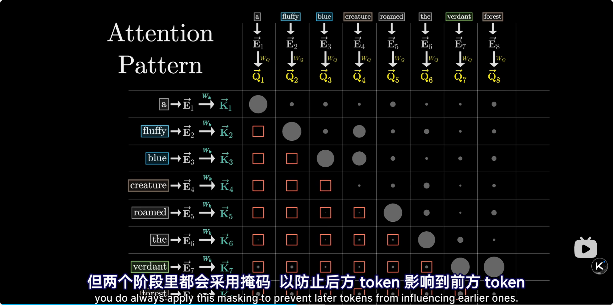

### Sglang Code Walkthrough


| 步骤 | 执行者（谁）                  | 动作（干什么）                       | 作用（为什么）                                               |
| ---- | ----------------------------- | ------------------------------------ | ------------------------------------------------------------ |
| 1    | **Scheduler** 本身            | `recv_requests`                      | 把门口信箱里所有新工单一次性拿进来。                         |
| 2    | **Scheduler** 本身            | `process_input_requests`             | 按类型分拣：生成/嵌入/撤销，把生成类单子留下。               |
| 3    | **Scheduler** 本身            | `handle_generate_request`            | 给每张生成单贴“序列号”，扔进 **waiting\_queue** 大筐。       |
| 4    | **Scheduler** 本身            | `get_next_batch_to_run`              | 从筐里挑能拼桌的单子，组成一张 **ScheduleBatch** 生产卡。    |
| 5    | **Scheduler** 本身            | `run_batch`                          | 把生产卡再包一层，变成 **ModelWorkerBatch** 交给车间。       |
| 6    | **TpModelWorker**（车间班长） | `forward_batch_generation`           | 接收批次，准备开工：先造出 **ForwardBatch** 工单。           |
| 7    | **TpModelWorker**（车间班长） | 把 ForwardBatch 递给 **ModelRunner** | 让真正的工人去跑模型。                                       |
| 8    | **ModelRunner**（工人）       | `forward_extend`                     | 调用模型 + **AttentionBackend** 电钻，算出 logits（概率表）。 |
| 9    | **ModelRunner**（工人）       | 把 logits 交回 **TpModelWorker**     | 班长拿到概率表。                                             |
| 10   | **TpModelWorker**（车间班长） | 调 `sample` 抽 next\_token\_ids      | 从概率表里“抽签”决定下一个 token 数字。                      |
| 11   | **TpModelWorker**（车间班长） | 把签号发回 **Scheduler**             | 告诉调度员“这批字我产完了”。                                 |
| 12   | **Scheduler** 本身            | `process_batch_result`               | 更新每张单的状态：写完没？没写完继续排队。                   |
| 13   | **Scheduler** 本身            | `tree_cache.cache_finished_req`      | 把已写完的单缓存起来，下次可复用 KV-cache，省钱。            |
| 14   | **Scheduler** 本身            | `check_finished`                     | 判断单是否真正完结：完结→送走；未完→留在筐里。               |
| 15   | **Scheduler** 本身            | `stream_output`                      | 把完结单封装成 **BatchTokenIDOut** 快递袋，丢给 DetokenizerManager 的信箱。 |

具体参考：[SGLang 后端代码解析](https://github.com/zhaochenyang20/Awesome-ML-SYS-Tutorial/blob/main/sglang/code-walk-through/readme-CN.md)

#### KV-Cache



因此，在逐个生成token的过程中，最后方词的不断迭代更新，只需要最后一个词进行forward，然后attention过程中，只需要计算它的q，与kv-cache中各个token这一次attention的key值点乘得到weight，然后和value值加权得到attention后的$\Delta E$，之后继续forward。

因此，KV-Cache很必要，但Q-Cache并没有（生成新词的$\Delta E$不需要旧词的query向量）

此外，表格中的"把已写完的单缓存起来，下次可复用 KV-cache，省钱。"是对相同前缀词提问的记录，对多个提问的复用，如：

- 提问1：*为什么英雄联盟的海克斯大乱斗*很好玩？
- 提问2：*为什么英雄联盟的海克斯大乱斗*在上架后讨论度很高？

#### 启动 Server（launch Sever）

“设置 logging、Server 参数、CUDA/NCCL 环境变量、进程间通信端口”是干嘛？
logging  打印哪些信息、存哪、级别多高，方便查错。
Server 参数 绑定 IP、端口、最大请求数、批大小等。
CUDA/NCCL 环境变量  告诉 GPU 驱动和通信库 **怎么组队、怎么跨卡传数据**。
进程间通信端口  ZeroMQ 的“门牌号”，让 TokenizerManager ↔ Scheduler ↔ DetokenizerManager 能互相喊话。 

tp = tensor-parallel，rank = 在本组里的序号
例：tp=4，四张卡一起算一个矩阵，tp_rank=0/1/2/3 分别表示“我在这一列里的第几个”。

data parallel replicas：完整模型的克隆副本，每个副本跑在不同 GPU 组上，同时服务不同请求。
例：8 张卡，tp=4 → 2 个 replica，各 4 张卡，互不相干，一起接单。

为什么开启数据并行要启动多个 replicas？
一个 replica 同一时间只能 batch 有限请求；**克隆 N 份就能同时吞吐 N 倍请求**，实现“加机器就加速”。

“TokenizerManager 和 DetokenizerManager 仅在第一个节点运行”——节点是啥？
**物理机器/容器**（node），不是单张 GPU。
多机部署时，只有 node-0 跑“翻译官”和“反向翻译官”，别的 node 只跑 Scheduler + 模型，**省得每台都加载同一份 tokenizer 浪费内存和跨网络同步**。

chat template 就是**“模型期望的聊天格式模板”**，大模型预训练时只见过固定格式的对话文本，如果你直接扔纯文本 `“帮我写快排”`，模型可能**回答质量下降**。chat template 负责把“裸文字”自动包成模型“吃过”的格式。
模型文件夹里一般自带 `tokenizer_config.json`，里面写了 `"chat_template": "..."`

##### （在两个节点上使用 共计 16 张 H100 部署 Llama 3.1 405B）部署的结构和协同工作流程：

| 物理节点               | GPU                     | 内存 ≈ | 在集群里的花名       | 负责活儿                                                |
| ---------------------- | ----------------------- | ------ | -------------------- | ------------------------------------------------------- |
| **Node-0**<br>(主节点) | 8×H100<br>≈ 640 GB VRAM | 640 GB | “前台+翻译+第一车间” | HTTP、TokenizerManager、DetokenizerManager、Scheduler-0 |
| **Node-1**<br>(副节点) | 8×H100<br>≈ 640 GB VRAM | 640 GB | “第二车间”           | 仅 Scheduler-1 + 模型 Worker                            |

1. **Node-0 上总指挥 `launch_engine` 先跑**
   - 设置 NCCL 环境：`MASTER_ADDR=node0 IP, MASTER_PORT=29500`
   - 加载 **FP8 权重**（405 GB → 203 GB，省显存）
   - 起 **TokenizerManager**(主进程) + **DetokenizerManager**(子进程)
   - 对本机 8 卡 tp=8 起 **Scheduler-0**（子进程）
2. **Node-1 上同样命令，但 `--node-rank=1`**
   - NCCL 自动连到 node0，完成 **world-size=16** 初始化
   - 只起 **Scheduler-1**（子进程），**不再起 Tokenizer/Detokenizer**
   - 两节点的 Scheduler 通过 **ZeroMQ** 向同一个 TokenizerManager 汇报“我就绪”
3. **DataParallelController（在 node0）**
   - 维护 **2 个 replica** 的健康状态
   - HTTP 流量用 **round-robin** 先送到 node0 或 node1 的 Scheduler；未来会换 **SGLang Router**

- **Tensor Parallelism(tp=8)** 在 **节点内** 完成；
- **Data Parallelism(dp=2)** 在 **节点间** 完成；
- KV-cache 只在本节点 8 卡间共享，**跨节点不共享**

ZeroMQ：
就像一条“**轻量级快递专线**”，专门帮不同进程（或不同机器）之间**快速收发小包裹（消息）**
是一个**独立的开源库**（libzmq），用 C 写成，但给 Python、Java、Go、Rust… 都提供了“pip-install 级”的语言绑定

#### 转发请求 (Forward Requests From Server)

| 步骤 | 谁                         | 怎么执行                                                     | 起什么作用                                                   |
| ---- | -------------------------- | ------------------------------------------------------------ | ------------------------------------------------------------ |
| 1    | **FastAPI 框架**           | 在代码里用装饰器 `@app.post("/v1/chat/completions")` 注册路由 | 把普通 Python 函数 `v1_chat_completions` 变成真正的“网页路口”，谁来 POST 都进这里。 |
| 2    | `v1_chat_completions` 函数 | 读 `raw_request.body` → `json()` → 校验成 **ChatCompletionRequest** 数据类 | 把原始 JSON 变成带代码提示的“结构化发票”，字段写错会立刻弹 422 错误。 |
| 3    | 同一函数内                 | 调辅助 `v1_chat_generate_request()` →**GenerateReqInput** 内部工单 + 填好 `sampling_params`（温度、top\_p、max\_tokens…） | 转成 SGLang 后台看得懂的“生产指令单”，温度、长度等备注一次到位。 |
| 4    | 仍在这个函数               | 调 `TokenizerManager.generate_request(req_input)` **并 await** | 把工单塞进 ZeroMQ 快递口，然后**原地阻塞/异步等待**直到后台把第一个 token 产出来。 |
| 5    | 拿到后台返回后             | 看 `stream` 字段：真→走 `generate_stream_resp()`；假→走 `v1_chat_generate_response()` | 决定是“边产边发”（打字效果）还是“全部收完再一次性给”。       |
| 6    | **流式分支**               | `generate_stream_resp` 是一个 **async 生成器**，内部不断 `yield` 小段 JSON | FastAPI 把每次 `yield` 立即塞进 HTTP chunk，浏览器看到就是实时跳动文字。 |
| 7    | **非流式分支**             | 直接 `await` 整个结果 → 调 `v1_chat_generate_response` 包成 **ChatCompletionResponse** → `ORJSONResponse` 回客户端 | 一次过给出完整回答，节省连接数，方便批量脚本解析。           |

FastAPI 是什么？
一个 Python 库，写几行就能搭出带自动文档、自动校验的 Web 接口。
负责监听 IP+端口，把浏览器/代码发来的 HTTP 包转成 Python 对象，再把 Python 结果转回 HTTP。

API endpoint：路径 + 方法
例子：`POST /v1/chat/completions` 这个字符串就是 endpoint；谁对它发 POST，FastAPI 就调对应函数。

请求本身是 HTTP 的 **请求体（body）**，格式是 JSON，例如：

```
{
  "model": "llama-3.1-405b",
  "messages": [{"role": "user", "content": "写快排"}],
  "stream": true,
  "temperature": 0.7
}
```

v1_chat_completions 只是转发吗？
不止转发，还负责：
① 把原始 JSON 校验成数据类 → ② 转成内部工单 → ③ 调后厨 → ④ 把后厨结果包成 OpenAI 兼容格式并流/非流地发回去。

generate_request 是 **后厨入口**，它只接收“已经转好的 GenerateReqInput”，然后做 tokenize + 发 ZMQ + 等结果。

“通过 v1_chat_generate_request 配置 sampling_params”在干什么？
v1_chat_generate_request 是个**普通函数**（不是类），名字前带 v1 只是**遵守 OpenAI 路径习惯（/v1/…）**。
它把 ChatCompletionRequest 里的 temperature、top_p、max_tokens 等字段 **抄到内部采样结构体 SamplingParams**，让后面模型知道“怎么抽样”。

##### 流式 vs 非流式响应区别

| 项目     | 流式 (stream=true)                           | 非流式 (stream=false)             |
| -------- | -------------------------------------------- | --------------------------------- |
| 返回节奏 | **每生成一个 token 立刻推一段**（SSE chunk） | **全部生成完一次性返回整段 JSON** |
| 用户体验 | 像 ChatGPT 实时“打字”                        | 等几秒后整段出现                  |
| 网络连接 | HTTP 长连接，分段传输                        | 普通短连接，一次打完              |
| 代码解析 | 前端需循环 `for chunk in response:`          | 直接 `response.json()` 即可       |

stream 参数什么时候设置？
用户发请求时自己写："stream": true 或 "stream": false
不写默认 false（非流式）。

Sampling（采样）就是 “从模型给出的概率表里抽签”，决定下一个 token 到底写谁。

1. 模型输出的是 logits（一长串概率），比如：

​	好: 35%， 的: 20%， 快: 15%， …

​	如果直接选概率最高的，文章会死板重复；Sampling 负责 按概率+随机性 抽一个，既合理又多样。

2. 常见采样“旋钮”

- temperature：概率温度。值高 → 更随机；值低 → 更确定。
- top_p：只从累积概率前 p% 的候选里抽，过滤长尾。
- top_k：只从概率最高的 k 个词里抽。

组合起来就能控制“创意 vs 稳定”的平衡。

#### TokenizerManager 生成请求（Generate Request In TokenizerManager）

检查 `update_weights_from_disk`：防止热更新权重时前后不一致，写完再接待新单。

看请求类型 vs 模型 `is_generation` 标志，不配就抛 400

调 `normalize_batch_and_arguments` → 补默认温度、top_p、max_tokens，并行采样、批处理，统一后续代码处理格式。

收到 Scheduler 的 `BatchTokenIDOut` → 调 DetokenizerManager 反向翻译 → 拿到 `BatchStrOut`

根据 stream 标志：流式→yield 每段文字；非流式→一次性返回完整对象

**TokenizerManager的批处理**取决于**GenerateReqInput 数据类**字段上，主要就两条：

1. `n > 1`（并行采样数）
   用户 HTTP 里写了 `"n": 8`，前端转内部工单时该字段就直接=8；`_handle_batch_request` 一看 `n>1`，立刻把同一条消息复制 8 份，每份再单独 tokenize，于是形成 8 条子请求。
2. `messages` 本身是列表且长度>1
   如果用户一次发来多轮对话（`messages=[...多轮...]`），而模型支持 batch对话，也会被当作“批”处理；此时不再复制，而是按轮次顺序逐条 tokenize 后打包。

TokenizerManager **自己并不“攒包”**，它收到一次 `generate_request()` 调用就**立即**把这条请求切成 token 并通过 ZeroMQ 塞进 Scheduler 的 waiting_queue；攒批（batching）是 **Scheduler 后面的事情**。

#### Scheduler 接收请求以及处理批次 (Scheduler Receive Requests and Process Batches)


##### 名词解释

| 名词                              | 是什么                                                       | 干嘛用                                                       |
| --------------------------------- | ------------------------------------------------------------ | ------------------------------------------------------------ |
| **server\_args**                  | 命令行或脚本传进来的“大杂烩”配置对象（Python 的 SimpleNamespace/dataclass） | 告诉整个系统：用几张卡、温度多少、端口几号、日志级别、是否启用 stream、模型路径… |
| **port\_args**                    | server\_args 的子集，专门放 **ZeroMQ 端口 号** 和 **NCCL 端口 号** | 让不同进程间有固定“门牌号”可喊人，避免端口冲突。             |
| **model\_config**                 | 从模型文件夹 `config.json` 读出来的 \*\* HuggingFace 配置 dict \*\*，被包成 Python 对象 | 拿隐藏层数、head 数、vocab\_size、RoPE 参数等，后面建模型、算显存、分 tensor-parallel 都靠它。 |
| **sessions**                      | 一个 **dict\[session\_id, Session]**，存多轮对话的上下文 KV-cache 句柄 | 实现“继续聊”：同一 session\_id 再来请求，Scheduler 直接找到旧缓存接着生成，不用重算历史。 |
| **metrics**                       | Prometheus 格式的 **计数器/直方图** 集合（token 数、延迟、队列长度） | 让运维看面板：每秒处理多少 token、平均延迟多少，方便做告警和弹性伸缩。 |
| **多模态图像处理器 placeholders** | 提前把 `CLIPImageProcessor` 或 `Qwen-VL 视觉编码器` 实例化好，占个坑 | 后面收到带图片的请求时，可直接调用，不必临时加载模型，减少首包延迟。 |


