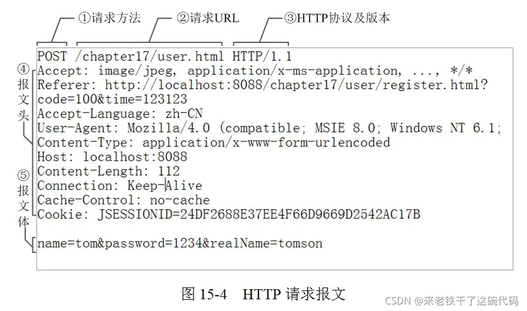
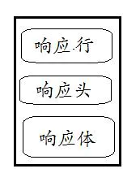
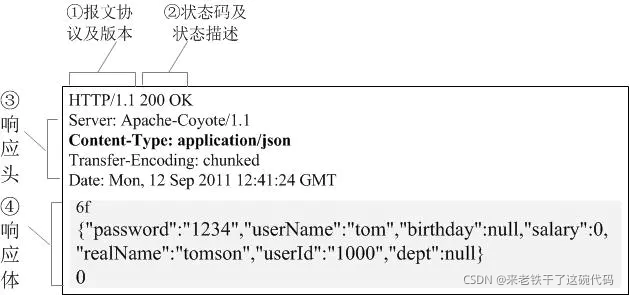
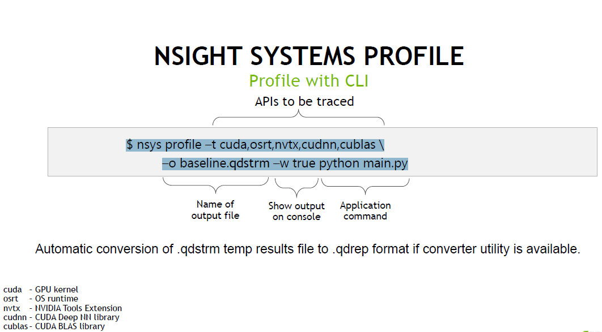
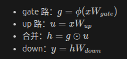

### URL

**URL的全称是“统一资源定位符”（Uniform Resource Locator）**。

它是互联网上用来标识某一处资源的地址，包含了资源的位置和访问方法。

### SDK

**SDK的全称为"软件开发工具包" (Software Development Kit)**

简单来说就是：辅助开发某一类软件的相关文档、演示举例和一些工具的集合，这些都可以称为 SDK。

### API

**API 的全称为"应用程序编程接口" (Application Programming Interface)**

API 是一些预先定义的函数，目的是提供开发人员应用程序，不需要直接去访问源码，或去深刻理解内部工作机制的细节。

总结区别如下：

SDK 是一种开发工具包，提供开发所需的资源（库、工具、示例代码等）来帮助开发人员建立应用程序。

API 是一种规范和接口，定义了不同应用程序之间的通信方式，允许它们进行数据交换和相互调用。

SDK 通常包含 API，但不限于 API，它还提供了其他开发所需的工具和资源。

### HTTP请求行、请求头、请求体、响应行、响应头、响应体

*请求为客户端向服务器端请求，响应为服务器端向客户端响应。*




① 是请求方法，HTTP/1.1 定义的请求方法有8种：GET、POST、PUT、DELETE、PATCH、HEAD、OPTIONS、TRACE,最常的两种GET和POST，如果是RESTful接口的话一般会用到GET、POST、DELETE、PUT。
② 为请求对应的URL地址，它和报文头的Host属性组成完整的请求URL
③ 是协议名称及版本号。
④ 是HTTP的报文头，报文头包含若干个属性，格式为“属性名:属性值”，服务端据此获取客户端的信息。
⑤ 是报文体，它将一个页面表单中的组件值通过param1=value1&param2=value2的键值对形式编码成一个格式化串，它承载多个请求参数的数据。不但报文体可以传递请求参数，请求URL也可以通过类似于“/chapter15/user.html? param1=value1&param2=value2”的方式传递请求参数。





①报文协议及版本；
②状态码及状态描述；
③响应报文头，也是由多个属性组成；
④响应报文体，即我们真正要的“干货”。

##### 响应状态码

告诉客户端本次请求的处理结果。

200 OK
处理成功

303 See Other
我把你redirect到其它的页面，目标的URL通过响应报文头的Location告诉你。

304 Not Modified
告诉客户端，你请求的这个资源至你上次取得后，并没有更改，你直接用你本地的缓存吧，我很忙哦，你能不能少来烦我啊！

404 Not Found
说明没有找到页面，即客户端的请求到了服务器端，无法请求到数据， 可能是客户端的请求格式有错误，也可能是服务器端的资源被删除了。

500 Internal Server Error
看到这个错误，最好查一下服务端的日志，看看是哪里出了问题。

### NCCL

The NVIDIA Collective Communication Library 实现了**针对NVIDIA GPU和网络**优化的**多GPU和多节点通信**原语。

### PR

是指 拉取请求（Pull Request）

### plugins

插件、扩展、外挂、附加组件

### OpenGL

OpenGL（Open Graphics Library）是一个跨语言、跨平台的应用程序编程接口（API），用于渲染2D和3D矢量图形。

### NVTX

NVIDIA Tools Extension

```bash
$ nsys profile -t cuda,osrt,nvtx,cudnn,cublas \
–o baseline.qdstrm -w true python main.py
```



### BERT

BERT（Bidirectional Encoder Representations from Transformers）是一种基于Transformer架构的预训练模型，广泛应用于自然语言处理（NLP）任务。

### Tensor Core

**Tensor Core** 是 NVIDIA GPU 中专为深度学习和 AI 工作负载设计的硬件单元，首次在 Volta 架构中引入。它通过支持 **混合精度计算**（FP16 和 FP32），显著加速矩阵运算，尤其是深度学习中的矩阵乘法和累加操作。

### Daemon

程序；守护线程；背景程序；守护进程；守护程序。在计算机领域，Daemon 通常被翻译为守护进程，指在后台运行的系统服务程序（如 Linux 中的 cron 或 sshd）。

### cuBLAS

‌**cuBLAS 是 NVIDIA 提供的 GPU 加速线性代数计算库**‌，专为高效执行矩阵运算（如乘法、加法）和向量操作设计

### FFN 

FFN 指的是 Feed-Forward Network（前馈网络）

### JIT

**JIT** 是 **Just-In-Time** 的缩写，中文常译为 **即时编译** 或 **实时编译**。它的核心思想是：**不预先（Ahead-Of-Time, AOT）将代码编译成机器码，而是在程序运行时，根据需要动态地将代码编译成优化的机器码。**

### Prefix

**（前缀）**在大模型推理的上下文中，**Prefix 指的是本次生成任务中已知的、固定的文本开头部分**。

**具体含义：**

- **在对话场景**：Prefix = 系统提示词 + 用户问题 + 模型历史回复
- **在续写场景**：Prefix = 给定的开头段落
- **在评分场景**：Prefix = 需要打分的完整文本

Prefix 的 **Key/Value（KV）可以被缓存**，避免重复计算，这是大模型推理优化的核心

**多模态生成**

- **一个Request → 一条多模态序列**

  例如：输入“描述这张图片”，序列包含图像编码 + 文本指令

  `prefix_lens`包含图像token + 文本指令token的总长度

### Request

**（请求）一个Request就是一次独立的生成任务**，通常对应一个用户的一次输入

- 每个Request有独立的：输入文本、生成参数（温度、top_p等）、KV缓存空间
- 在批量推理中，多个Request会被打包成一个Batch同时处理，提高GPU利用率

### hidden_layers

隐藏层，大模型有多少层

### MOE-FNN

1. **Router/Gate（路由器）**对每个 token 算一个分数（logits），选出 top‑k 个 experts（以及对应权重）。
2. **只让这 top‑k 个 experts 的 FFN 参与计算**（其余 experts 不算）。
3. 把 top‑k 个 expert 的输出按权重合成一个输出（通常是加权求和；是否归一化要看实现）。

**常见的 expert MLP**

经典两层 MLP（无门控）

- 第一层：上投影（up / gate_proj）

  h=ϕ(xWup)*h*=*ϕ*(*x**W**u**p*)

- 第二层：下投影（down / proj）

  y=hWdown*y*=*h**W**d**o**w**n*

操作：


