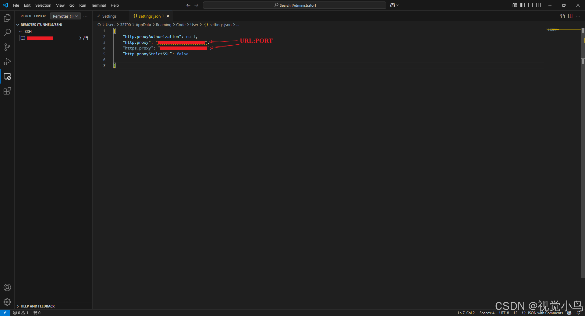

### 【VScode】设置代理

[【VScode】设置代理，通过代理连接服务器](https://blog.csdn.net/qq_43633528/article/details/144903155)

打开`setting.json` 文件

### 容器中使用copilot就是会有问题

[快速解决vscode远程连接时copilot提示脱机状态无法使用的问题](https://blog.csdn.net/messi10101010___/article/details/149963354)