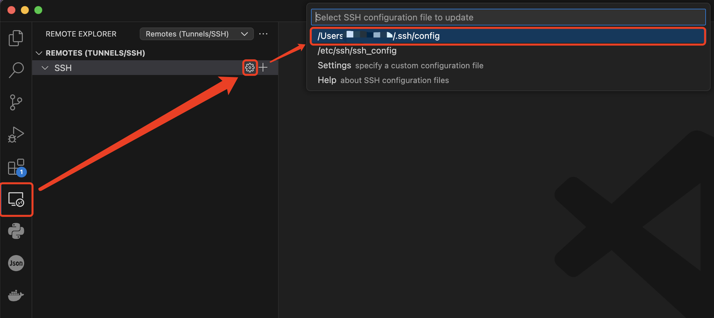
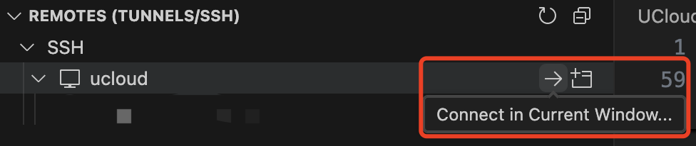
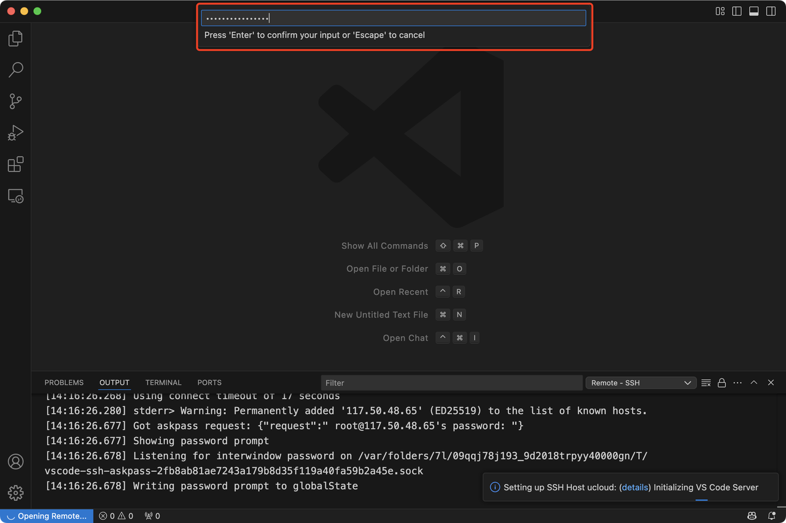

### 本地数据上传

#### SCP远程拷贝

1. 实例开机，找到实例外网IP地址，实例用户名为root，社区镜像创建的实例，端口号为23（虚机实例用户名为ubuntu，端口号为22）。

2. 注意下方指令需要在您本地的机器上执行，向实例中拷贝数据，而不是在实例中执行该命令; 将本地文件或文件夹拷贝到远程：

   ```bash
   scp -rP <端口号> <本地文件/文件夹路径> <远程用户名>@<实例外网IP地址>:<实例目标路径>
   
   # 举例
   scp -rP 23 /home/jiew/jiewc/model-download/Qwen3-30B-A3B-GPTQ-Int4 root@117.50.216.137:/root/model-download
   ```

   将本地电脑的`myfile.txt`文件，下载在到IP地址为`192.168.1.1`的实例，实例用户名为root，端口为23，实例下载路径为`home/root`。

3. 将实例中的数据拷贝到本地:

   ```bash
   scp -rP <端口号> <用户名>@<实例外网IP地址>:<实例中的文件/文件夹> <本地文件/文件夹>
   ```

   实例用户名为root，端口为23。

### VS Code连接

连接时请确保实例处于启动状态。

1. 通过 VSCode 连接前，您需要安装用于建立 SSH 连接的扩展 `Remote - SSH`。如果安装扩展后没有立即生效，可以尝试重启 VSCode。

2. 安装扩展后，点击侧边栏中的Remote - SSH扩展图标，再点击设置按钮在本地用户路径下新建一个ssh配置：
   

3. 新建的 SSH 配置内容为空，您可以参考以下模版，修改 SSH 的连接名称、远程IP地址（实例的外网IP地址）、登录用户名、端口和密钥的存储路径：

   ```
   配置模版：
   Host myserver # 自定义连接名称
   HostName 192.168.1.100 # 实例的外网IP地址
   User root # 登录用户名
   Port 23 # 端口
   IdentityFile ~/.ssh/id_rsa # 指定私钥（非密码登录时）
   ```

   *在 SSH 配置文件 (~/.ssh/config) 中，不能明文指定密码，这是出于安全考虑（SSH 协议本身不支持在配置文件中存储密码）。*

   **不同镜像类型的默认登录用户名和端口：**

   | 镜像类型          | 系统类型 | 登录名        | 端口 | 密码     |
   | ----------------- | -------- | ------------- | ---- | -------- |
   | 社区镜像          | Docker   | root          | 23   | 见控制台 |
   | 平台镜像-基础镜像 | Docker   | root          | 23   | 见控制台 |
   | 平台镜像-系统镜像 | Ubuntu   | ubuntu        | 22   | 见控制台 |
   | 平台镜像-系统镜像 | Windows  | administrator | -    | 见控制台 |

4. 创建好配置之后，通过点击相应 SSH 连接右侧的按钮打开一个新的窗口并建立 SSH 远程连接
   

5. 下一步，在弹出的选项框中选择Continue，保存首次 SSH 连接远程服务器的密钥：

6. 接着，在弹出的输入框中输入远程服务器的登录用户密码，输入完成后按下Enter（回车键）进行登录验证。您可以在相应的实例信息中，找到服务器的登录用户密码，通过点击旁边的复制图标来复制密码。
   

7. 连接成功后，您可以通过左侧的Open Folder按钮打开远程服务器中的目录，作为工作区目录：

8. 首次打开工作区目录时，会弹出 “是否信任该文件夹” 对话框，这是 VSCode 的 工作区信任机制。在确保工作环境安全的情况下，可直接点击图示按钮，以便进行后续的工作：

**至此，您已完成了使用 VSCode 连接实例远程服务器的所有操作。**


