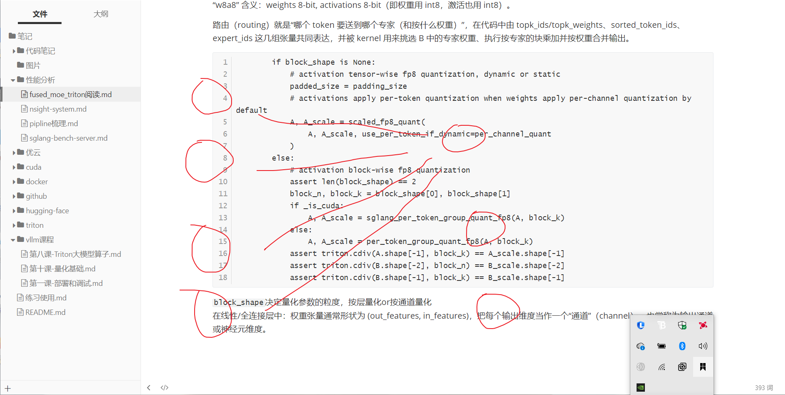

```
def invoke_fused_moe_kernel(
    A: torch.Tensor,
    B: torch.Tensor,
    bias: Optional[torch.Tensor],
    C: torch.Tensor,
    A_scale: Optional[torch.Tensor],
    B_scale: Optional[torch.Tensor],
    B_zp: Optional[torch.Tensor],
    topk_weights: torch.Tensor,
    topk_ids: torch.Tensor,
    sorted_token_ids: torch.Tensor,
    expert_ids: torch.Tensor,
    num_tokens_post_padded: torch.Tensor,
    mul_routed_weight: bool,
    top_k: int,
    config: Dict[str, Any],
    compute_type: tl.dtype,
    use_fp8_w8a8: bool,
    use_int8_w8a8: bool,
    use_int8_w8a16: bool,
    use_int4_w4a16: bool,
    per_channel_quant: bool,
    block_shape: Optional[List[int]] = None,
    no_combine: bool = False,
    a_use_tma: bool = False,
    b_use_tma: bool = False,
    c_sorted: bool = False,
    filter_expert: bool = True,
)
```

“w8a8” 含义：weights 8-bit, activations 8-bit（即权重用 int8，激活也用 int8）。

路由（routing）就是“哪个 token 要送到哪个专家（和按什么权重）”，在代码中由 topk_ids/topk_weights、sorted_token_ids、expert_ids 这几组张量共同表达，并被 kernel 用来挑选 B 中的专家权重、执行按专家的块乘加并按权重合并输出。

```
    if use_fp8_w8a8:
        assert B_scale is not None
        if block_shape is None:
            # activation tensor-wise fp8 quantization, dynamic or static
            # 通道内使用一组量化参数
            padded_size = padding_size
            # activations apply per-token quantization when weights apply per-channel quantization by default
            A, A_scale = scaled_fp8_quant(
                A, A_scale, use_per_token_if_dynamic=per_channel_quant
            )
        else:
            # activation block-wise fp8 quantization
            # block-wise（块分组）量化的含义就是把权重按一个矩阵块（例如 block_n × block_k）划分，每个块共享一组量化参数（scale / zero‑point）。输入的activation按block_k量化。
            assert len(block_shape) == 2
            block_n, block_k = block_shape[0], block_shape[1]
            if _is_cuda:
                A, A_scale = sglang_per_token_group_quant_fp8(A, block_k)
            else:
                A, A_scale = per_token_group_quant_fp8(A, block_k)
            assert triton.cdiv(A.shape[-1], block_k) == A_scale.shape[-1]
            assert triton.cdiv(B.shape[-2], block_n) == B_scale.shape[-2]
            assert triton.cdiv(B.shape[-1], block_k) == B_scale.shape[-1]
```

`block_shape`决定量化参数的粒度，按层量化or按通道量化
在线性/全连接层中：权重张量通常形状为 (out_features, in_features)，把每个输出维度当作一个“通道”（channel），也常称为输出通道或神经元维度。


在你代码里的 B 张量，形状为 (E, N, K)：对于某个专家 e 和输出通道 n，B[e, n, :] 就是该通道的所有权重（它们在 per‑channel 量化下共享同一个 scale/zero‑point)

举例：

- 若 A shape = (M, 1024)，block_k = 32 → A_scale.shape[-1] 应为 1024/32 = 32（每 token 有 32 个 group scale）。
- 若 B shape = (E, N, 1024)，block_n = 128, block_k = 32 → B_scale 的形状需覆盖 N/128 × 1024/32 的块数（并且代码对这些维度有断言检查）。

A_scale 含义与形状：A_scale 为“每个 token 每个 group 的 scale”，通常形状为 (num_tokens, num_groups)，其中 num_groups = ceil(K / block_k)。代码断言：triton.cdiv(A.shape[-1], block_k) == A_scale.shape[-1]。

不做块级量化）下，代码强制要求采用“按通道量化”（per‑channel）

```
    elif use_int8_w8a8:
        assert B_scale is not None
        if block_shape is None:
            # activation channel-wise int8 quantization
            assert (
                per_channel_quant
            ), "int8 quantization only supports channel-wise quantization except for block-wise quantization"   #只支持权重按通道的量化
            A, A_scale = per_token_quant_int8(A)
        else:
            # activation block-wise int8 quantization
            assert len(block_shape) == 2
            block_n, block_k = block_shape[0], block_shape[1]
            if _is_cuda:
                A, A_scale = sglang_per_token_group_quant_int8(A, block_k)
            else:
                A, A_scale = per_token_group_quant_int8(A, block_k)
            assert triton.cdiv(A.shape[-1], block_k) == A_scale.shape[-1]
            assert triton.cdiv(B.shape[-2], block_n) == B_scale.shape[-2]
            assert triton.cdiv(B.shape[-1], block_k) == B_scale.shape[-1]
    elif use_int8_w8a16 or use_int4_w4a16:
        assert B_scale is not None
        assert block_shape is None or block_shape[0] == 0
    else:
        assert A_scale is None
        assert B_scale is None
```

第五行`assert`不做块级量化下，代码强制要求采用“按通道量化”（per‑channel）。也就是说：该路径只支持权重按通道的量化，而不支持整层（per‑tensor）或按 token 的量化。

他不是只支持channel-wise quantization吗，但是下面函数名是per_token_quant_int8？
不是矛盾，区分“权重的量化粒度”和“激活的量化粒度”：

- 那个 assert 是在说权重（B）在 use_int8_w8a8 且 block_shape=None 时必须是 per‑channel（per_channel_quant=True）。它约束的是 B_scale 的粒度，不是 A_scale。
- per_token_quant_int8 是对激活 A 做“按 token”的量化（产生 A_scale）。这是合法且常见的组合：权重按通道量化（每个输出通道一个 scale），激活按 token 量化（每个 token 一个 scale），二者配合用于反量化/缩放计算。

```
    grid = lambda META: (
        triton.cdiv(sorted_token_ids.shape[0], META["BLOCK_SIZE_M"])
        * triton.cdiv(B.shape[1], META["BLOCK_SIZE_N"]),
    )
```

grid 是一个 lambda，它接收 Triton 在编译/启动时传入的 META（包含编译期常量，比如 BLOCK_SIZE_M、BLOCK_SIZE_N 等），返回要启动的 program 数量。

M_total = sorted_token_ids.shape[0]（重复 top_k 后并做 padding 的 token 数）

N = B.shape[1]（输出维 / 输出通道数）。
即把输出矩阵 C 划分为 BLOCK_SIZE_M × BLOCK_SIZE_N 的子块，grid 给出需要多少子块（每个子块对应一个 Triton program）。

- sorted_token_ids 是一个一维整型数组，长度为 M_post_padded（通常等于 num_tokens * top_k，经 padding 至 BLOCK_SIZE_M 的倍数）。

- 它按专家（expert）对 token 索引进行分组并重复 top_k 次。举例：原来有 T 个 token、每 token 的 top_k 个专家，那么 sorted_token_ids 先把每个 token 的重复 top_k 次，随后按专家 id 对这些重复项进行排序，使得属于同一专家的 token 连在一起。最后如果不整除 BLOCK_SIZE_M，会在末尾填充（padding）。

```
    K = B.shape[2] - padded_size
    if K % config["BLOCK_SIZE_K"] == 0:
        even_Ks = True
    else:
        even_Ks = False

    if (
        (use_int8_w8a16 or use_int4_w4a16)
        and block_shape is not None
        and block_shape[1] > 0
    ):
        assert B_scale is not None and B_scale.ndim == 3
        assert B_zp is None or B_zp.ndim == 3
        assert bias is None
        fused_moe_kernel_gptq_awq[grid](
            A,
            B,
            C,
            B_scale,
            B_zp,
            topk_weights,
            sorted_token_ids,
            expert_ids,
            num_tokens_post_padded,
            B.shape[1],
            A.shape[1],
            sorted_token_ids.shape[0],
            topk_ids.numel(),
            A.stride(0),
            A.stride(1),
            B.stride(0),
            B.stride(2),
            B.stride(1),
            C.stride(1),
            C.stride(2),
            B_scale.stride(0),
            B_scale.stride(2),
            B_scale.stride(1),
            B_zp.stride(0) if B_zp is not None else 0,
            B_zp.stride(2) if B_zp is not None else 0,
            B_zp.stride(1) if B_zp is not None else 0,
            group_size=block_shape[1],
            MUL_ROUTED_WEIGHT=mul_routed_weight,
            top_k=top_k,
            compute_type=compute_type,
            has_zp=B_zp is not None,
            use_int4_w4a16=use_int4_w4a16,
            use_int8_w8a16=use_int8_w8a16,
            even_Ks=even_Ks,
            filter_expert=filter_expert,
            **config,
        )
```

B_zp（bias point / zero‑point）

- 含义：量化权重时用于偏移的 zero‑point（整数域到真实值的偏移）。反量化时常用公式 (q - zp) * scale 来恢复数值。

- 形状/布局：应与 B_scale 的粒度匹配。例：B.shape=(E,N,K) 时
  - per‑channel: B_zp 可为 (E, N)（或可广播到该维度）；
  - block‑wise GPTQ/AWQ: B_zp 期望 ndim==3，类似 (E, n_blocks, k_blocks) 对应每块一个 zp（代码在该分支有断言）。
- 如果 B_zp 为 None：kernel 会用默认常数偏移（代码里 b_zp_num = 8 或 128，取决于量化格式）来代替（对应无显式 zp 时的偏置处理）。

bias（线性层偏置）

- 含义：在 matmul 累加完成后加到输出上的偏置项（典型线性层 bias）。

- 在代码里的作用：在之后 fused_moe_kernel 路径会在乘 routed weight 前/后把 bias 加到 accumulator（见 accumulator += bias）。

- 形状/布局：通常为每专家每输出通道一个值，常见 shape 为 (E, N)

- 限制：GPTQ/AWQ 的 block‑wise 分支在此实现中不支持 bias（代码有 assert bias is None）。

```
    else:
        if a_use_tma or b_use_tma:
            # TMA descriptors require a global memory allocation
            def alloc_fn(size: int, alignment: int, stream: Optional[int]):
                return torch.empty(size, device="cuda", dtype=torch.int8)

            triton.set_allocator(alloc_fn)
        if a_use_tma:
            a_desc = TensorDescriptor(
                A, A.shape, A.stride(), [config["BLOCK_SIZE_M"], config["BLOCK_SIZE_K"]]
            )
        else:
            a_desc = None
        if b_use_tma:
            b_desc = TensorDescriptor(
                B,
                B.shape,
                B.stride(),
                [1, config["BLOCK_SIZE_N"], config["BLOCK_SIZE_K"]],
            )
        else:
            b_desc = None
```

在这个分支里代码在判断并准备是否使用 Triton 的 TensorDescriptor（即 **TMA/Tensor Memory Access**）优化：条件是 a_use_tma 或 b_use_tma 为 True 时进入。

- 做了两件事：
  1. 调用 triton.set_allocator(alloc_fn) 注册一个全局分配函数（TMA 描述符需要在全局分配临时内存），alloc_fn 返回一个 cuda 上的 torch.empty(int8) 缓冲区；
  2. 根据标志分别构造 a_desc 和/或 b_desc（TensorDescriptor），否则置为 None。a_desc 用于 A 的按块加载（块形状 [BLOCK_SIZE_M, BLOCK_SIZE_K]），b_desc 用于 B 的按块加载（块形状 [1, BLOCK_SIZE_N, BLOCK_SIZE_K]）。
- 目的/后果：如果构造了 descriptor，则后续调用 fused_moe_kernel 时会传入 a_desc/b_desc，kernel 内可以用 a_desc.load(...) / b_desc.load(...) 获取**更高效的 TMA 加载路径**；否则走**普通指针加载路径**

