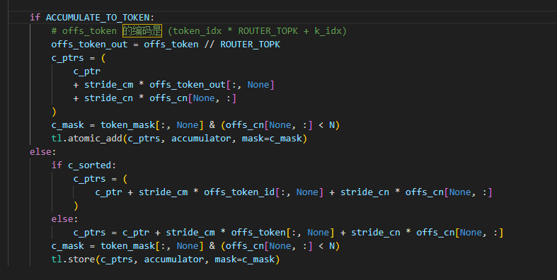
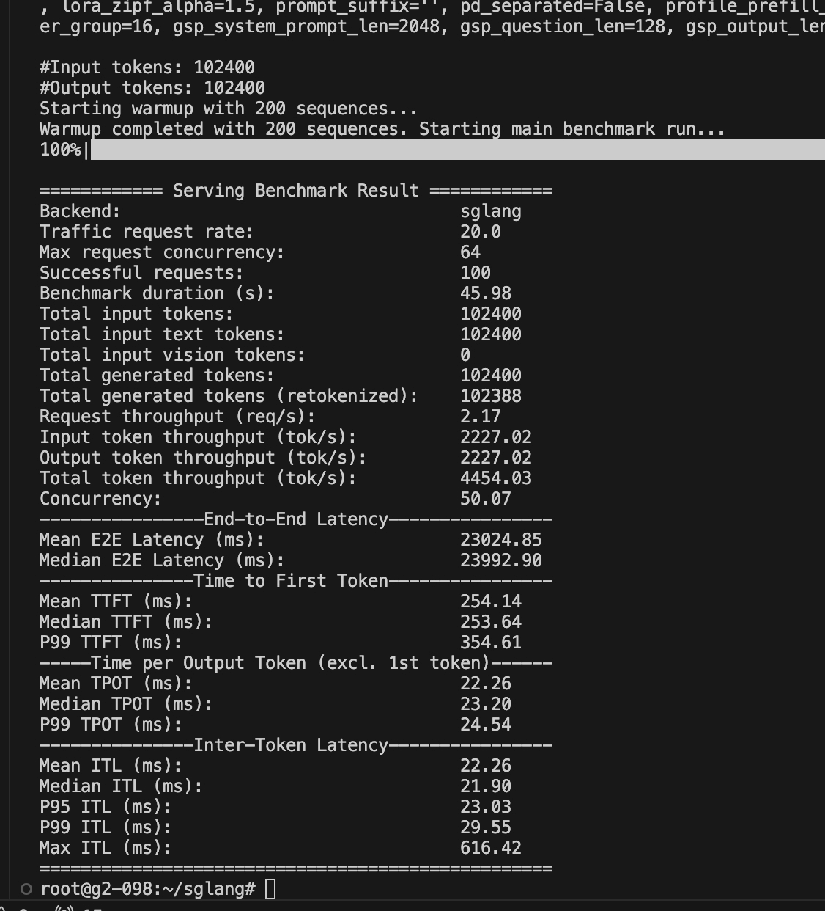
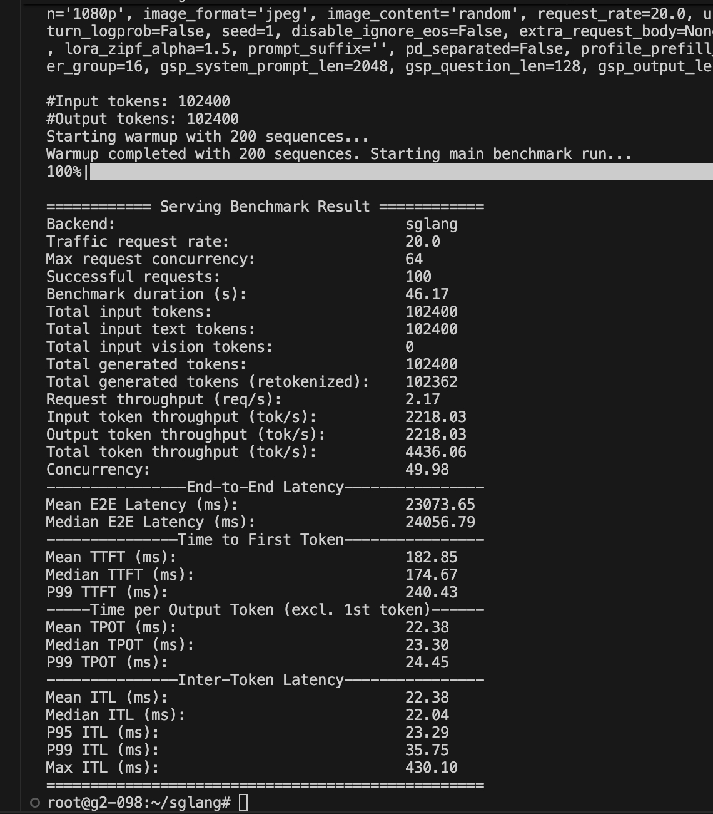
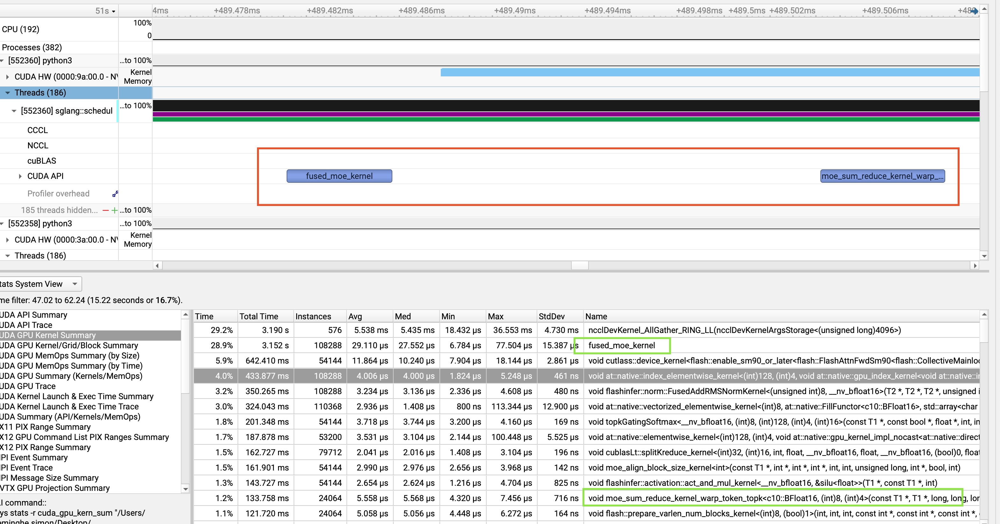

### MoE算子与sum reduce的融合优化

#### 实现关键

else中是原实现

代码中有两个关键：

- MoE会先把一个batch内的行重复topk次，并把每行按专家聚合重新排序

- `offs_token` 这个是当前每行在原聚合前的位置id
- `offs_token_id`z这个就是聚合后行的每行id

#### 优化前后benchmark

before：

after优化后：

TTFT改善：（254-182）/ 254 = 28.3%。

#### 该优化的定位分析

由perf结果可知：fused moe kernel 和它之后的moe_sum_all_reduce 存在**较大间隔**，且moe_sum_all_reduce 的**调用instances为24000多**，调用**频次非常高**。为了消除这个较大的间距，较少**kernel launch的消耗**，以及**频繁的IO访存**，降低**显存带宽**开销。进行了fused triton moe & moe sum reduce 的kernel 融合。将moe之后的ruduce的topk 专家聚合过程融合为一个kernel。
优势总结：

- 降低核函数调度开销
  每次启动核函数，GPU 需要分配 SM、加载指令、初始化资源，是固定耗时。
- 降低全局内存读写开销
  Expert 计算结果需先写到全局内存，sum reduce 再从全局内存读，写完再写输出。
- 降低核函数同步开销
  必须等前一个核函数（如 Expert 计算）完全结束，才能启动 sum reduce。
- 降低显存带宽开销
  临时张量的读写占用显存带宽，导致有效计算的带宽占比下降，拖慢整体速度
